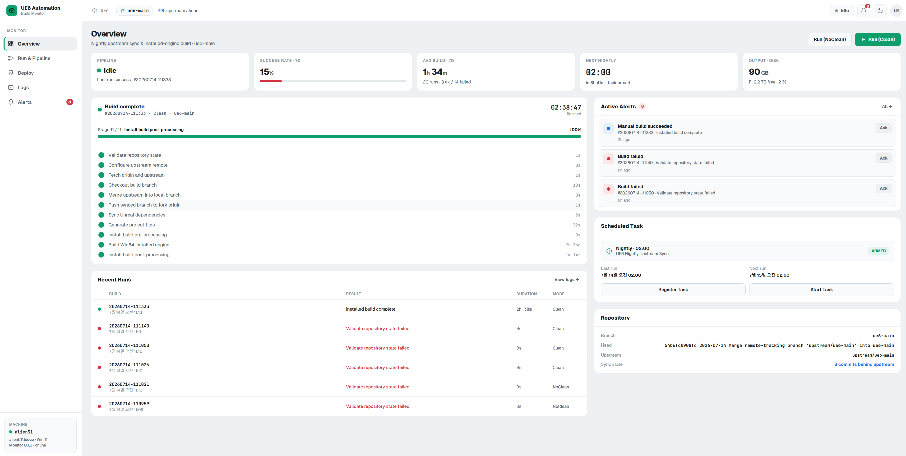
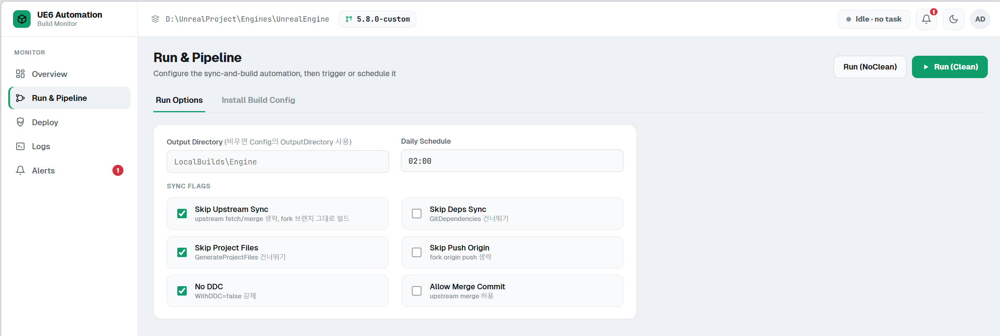
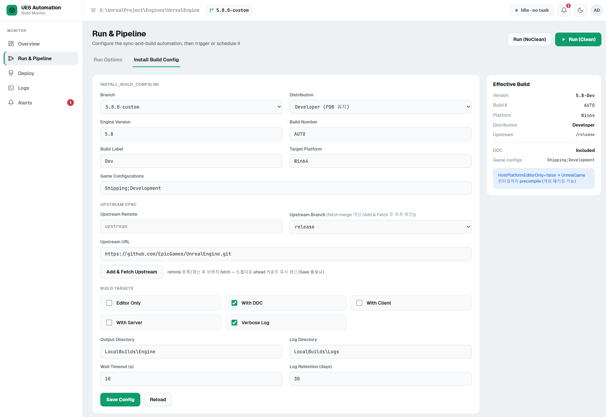
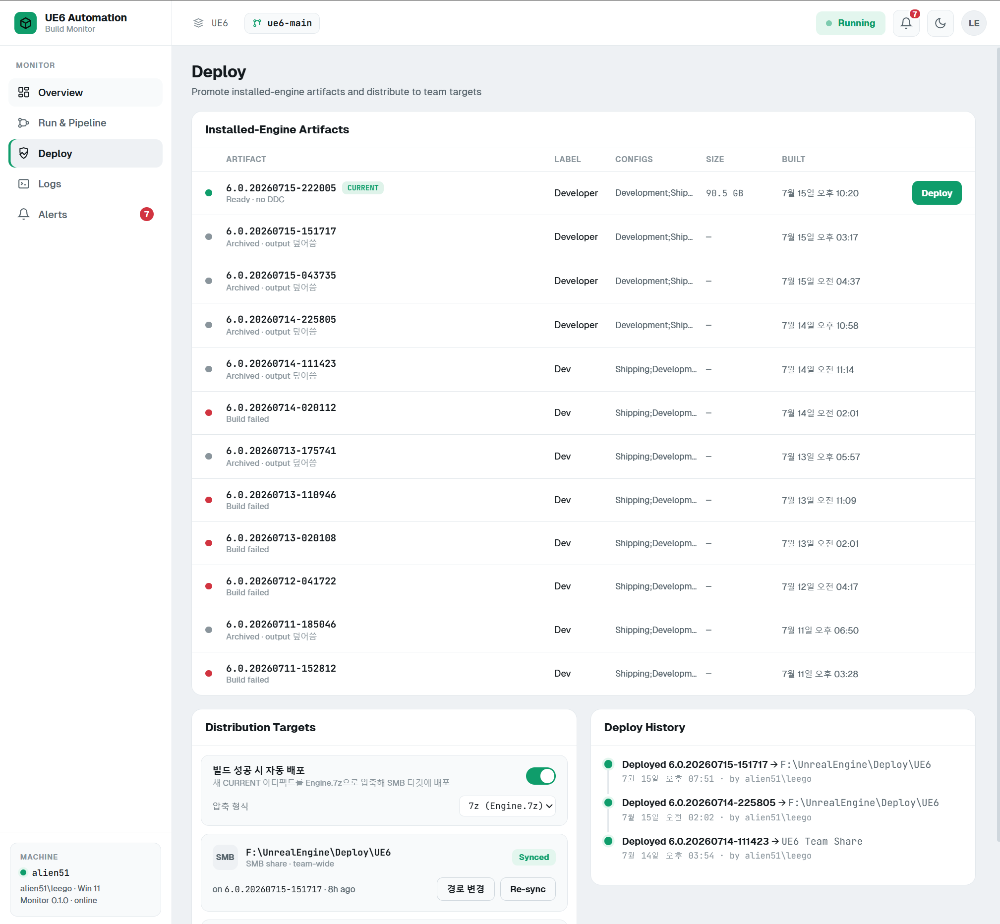
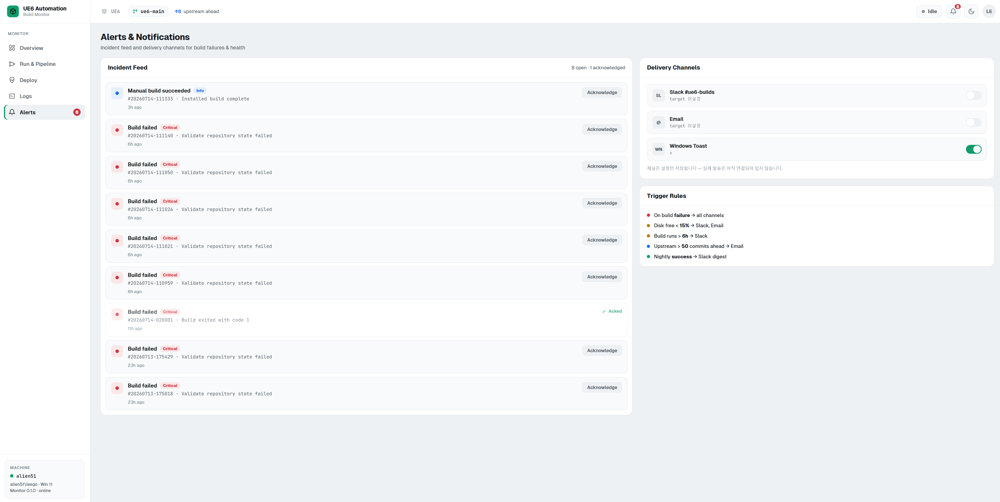

# AutomationMonitor

Unreal Engine 소스 저장소의 **nightly upstream sync**와 **installed-engine build**를 모니터링·실행·배포하는 웹 대시보드입니다.  
`Automation/SyncAndBuildInstalled.ps1` 파이프라인을 감시하고, Windows 작업 스케줄러 등록, 로그 열람, 디스크·upstream 상태 알림, SMB 배포까지 한 화면에서 처리합니다.

이 도구는 자신만의 디렉터리에서 독립적으로 실행되며, 빌드·배포 대상이 되는 언리얼 엔진 클론과는 별도로 존재합니다. 대시보드 상단의 저장소 선택기에서 로컬에 클론된 UE 저장소를 등록·전환하며, 각 저장소는 자신만의 빌드 설정·배포 타깃·알림 설정을 독립적으로 가집니다. 자세한 내용은 [저장소 선택](#저장소-선택)을 참고하세요.

## 주요 기능

| 화면 | 설명 |
|------|------|
| Overview | 파이프라인 상태, 7일 성공률, 디스크·출력 용량, 스케줄 작업, Git/upstream 요약 |
| Run & Pipeline | Run 옵션, `install_build_config.ini` 편집, 즉시 실행·스케줄 등록 |
| Deploy | installed-engine 아티팩트 목록, SMB 타깃 압축 배포, 자동 배포, 배포 이력 |
| Logs | 빌드·모니터 로그 tail, 필터, 다운로드 |
| Alerts | 인시던트 피드, 알림 채널 설정, 트리거 규칙 |

## 스크린샷

### Overview

대시보드에서 파이프라인 idle/running 상태, 최근 실행, 디스크 여유, 스케줄 작업, 활성 알림을 한눈에 확인합니다.



### Run & Pipeline — Run Options

Clean/NoClean 실행, 일일 스케줄 시각, upstream/deps/project files/DDC 등 sync 플래그를 설정합니다. 변경 사항은 `workspace.json`에 자동 저장됩니다.



### Run & Pipeline — Install Build Config

브랜치·버전·타깃 플랫폼, upstream remote, 빌드 타깃(Editor/DDC/Client/Server), 출력·로그 경로를 UI에서 편집하고 `install_build_config.ini`에 반영합니다.



### Deploy

`build_summary_*.txt` 기준 최신 성공 빌드를 CURRENT 아티팩트로 표시하고, SMB 공유 등 배포 타깃에 `Engine.7z`(또는 `Engine.zip`)로 압축 배포합니다. **빌드 성공 시 자동 배포**를 켜면 새 CURRENT 아티팩트가 생길 때마다 한 번씩 자동으로 배포합니다 (모니터에서 실행한 빌드와 스케줄 작업 빌드 모두 해당).



### Alerts & Notifications

빌드 실패, 디스크 부족, 장시간 빌드, upstream 지연 등 인시던트를 표시합니다. Slack·Email·Windows Toast 채널과 임계값을 설정할 수 있습니다. (채널 전송은 설정 저장만 지원, 실제 발송은 미연결)



## 요구 사항

- Windows 10/11
- [Node.js](https://nodejs.org/) 18 이상 (LTS 권장)
- Git, PowerShell 5.1+
- [7-Zip](https://www.7-zip.org/) — 배포 압축용. `C:\Program Files\7-Zip\7z.exe`를 먼저 찾고, 없으면 `PATH`의 `7z`를 사용합니다.
- 모니터링 대상: 로컬에 클론된 Unreal Engine 저장소 (`.git` 포함) — 저장소 선택기에서 등록
- 빌드 로그: `<선택한 저장소>/LocalBuilds/AutomationLogs/`
- 모니터 로그·상태·설정: `<선택한 저장소>/LocalBuilds/AutomationMonitor/`

## 빠른 시작

### 원클릭 실행 (권장)

| 모드 | 실행 파일 | 접속 URL |
|------|-----------|----------|
| 개발 | `Start-Dev.cmd` 또는 `start-dev.ps1` | http://127.0.0.1:5173 |
| 운영 | `Start-Prod.cmd` 또는 `start-prod.ps1` | http://127.0.0.1:4174 |
| 종료 | `Stop.cmd` 또는 `stop.ps1` | — |

개발 모드는 API 서버(`4174`)와 Vite HMR UI(`5173`) 두 프로세스를 띄웁니다. 운영 모드는 `vite build` 후 단일 Node 프로세스가 UI와 API를 함께 제공합니다. `Stop.cmd`는 두 포트(`4174`·`5173`)의 프론트엔드·백엔드를 한 번에 종료합니다.

### 수동 실행

```powershell
cd AutomationMonitor
npm install

# 개발: 터미널 1
npm run dev

# 개발: 터미널 2
npm run ui

# 운영
npm run prod
```

### Windows 작업 스케줄러로 상시 구동

이 도구의 저장소 루트에서 (대상 UE 저장소가 아님):

```powershell
.\Automation\Register-MonitorServerTask.ps1
```

기본 포트는 `4174`입니다. 변경 시 환경 변수를 사용합니다.

```powershell
$env:UE6_MONITOR_PORT = "8080"
$env:UE6_MONITOR_HOST = "0.0.0.0"   # 기본값
```

## 저장소 선택

AutomationMonitor는 `Automation/`(파이프라인 스크립트)와 함께 자신만의 디렉터리에 위치하며, 빌드 대상 UE 저장소와는 분리되어 있습니다. 대시보드 상단의 저장소 표시를 클릭하면 저장소 관리 모달이 열립니다.

- **등록**: 로컬 경로(폴더 찾아보기 지원)를 입력해 UE 클론을 등록합니다. `.git`이 있어야 합니다. 처음 등록한 저장소가 자동으로 활성 저장소가 됩니다.
- **전환**: 목록에서 다른 저장소를 선택하면 즉시 활성 저장소가 바뀝니다. 빌드가 실행 중일 때는 전환·삭제할 수 없습니다.
- **저장 위치**: 등록된 저장소 목록·활성 선택은 `AutomationMonitor/repos.json`에 저장됩니다 (호스트별 경로라 git에 커밋되지 않음). 각 저장소의 빌드 설정·Run 옵션·배포 타깃·알림 임계값은 해당 저장소의 `LocalBuilds/AutomationMonitor/workspace.json`에 독립적으로 저장됩니다.
- 저장소를 하나도 등록하지 않았다면 대시보드는 빈 상태 화면만 보여줍니다.

## 아키텍처

```
Automation/          # 파이프라인 스크립트 (SyncAndBuildInstalled.ps1 등) — 도구 소유, 대상 저장소와 무관
AutomationMonitor/
├── server/          # Node HTTP API (상태 수집, 실행, 배포, 저장소 레지스트리)
├── src/             # React UI (Vite)
├── repos.json       # 등록된 저장소 목록·활성 선택 (gitignored)
├── dist/            # 운영 빌드 산출물 (vite build)
└── start-*.ps1      # 원클릭 런처
```

- **프론트엔드**: React + Vite. 5초마다 `/api/status` 폴링.
- **백엔드**: 순수 Node `http` 서버. PowerShell·`git`·`7z` 호출은 현재 활성 저장소를 대상으로 실행. 자동 배포 워처는 1분마다 새 CURRENT 아티팩트를 확인.
- **파이프라인 파싱**: `SyncAndBuildInstalled.ps1` 래퍼 로그의 `START`/`DONE` 단계와 UBT 빌드 로그를 합쳐 진행률 계산.
- **설정**: UI 편집 값은 활성 저장소의 `LocalBuilds/AutomationMonitor/workspace.json`과 저장소 루트의 `install_build_config.ini`에 저장. ACK·배포 이력은 같은 폴더의 `monitor-state.json`.

### 파이프라인 단계

`SyncAndBuildInstalled.ps1`의 `Invoke-LoggedStep` 이름과 1:1 대응합니다.

1. Validate repository state (sync 전 `Templates/`의 tracked 변경은 자동 discard — 빌드/에디터가 다시 쓰는 `DefaultEngine.ini`가 매번 sync를 막던 문제 해결)  
2. Configure upstream remote  
3. Fetch origin and upstream  
4. Checkout build branch  
5. Merge upstream into local branch  
6. Push synced branch to fork origin  
7. Sync Unreal dependencies  
8. Generate project files  
9. Install build pre-processing  
10. Build Win64 installed engine  
11. Install build post-processing  

## 설정 파일

### workspace.json

활성 저장소의 `LocalBuilds/AutomationMonitor/workspace.json`에 저장됩니다 (저장소마다 별도 파일).

| 섹션 | 용도 |
|------|------|
| `build` | `install_build_config.ini`와 동기화되는 빌드 설정 |
| `runOptions` | Run 탭 플래그·스케줄 시각·출력 디렉터리 |
| `deploy.targets` | SMB/P4 등 배포 타깃 (SMB만 실배포) |
| `deploy.auto` | 빌드 성공 시 자동 배포 on/off와 대상 타깃 (`{ enabled, targetId }`) |
| `deploy.format` | 배포 압축 형식 — `7z`(기본) 또는 `zip` |
| `alerts.channels` | Slack, Email, Windows Toast on/off |
| `alerts.thresholds` | 디스크 %, upstream 커밋 수, 빌드 시간(h) |

### 환경 변수

| 변수 | 기본값 | 설명 |
|------|--------|------|
| `UE6_MONITOR_PORT` | `4174` | API·운영 UI 포트 |
| `UE6_MONITOR_HOST` | `0.0.0.0` | 바인드 주소 |

## API 개요

| Method | Path | 설명 |
|--------|------|------|
| GET | `/api/status` | 전체 상태 (Git, 파이프라인, 디스크, 알림, 로그 목록) |
| POST | `/api/run-now` | 즉시 빌드 실행 |
| POST | `/api/stop` | 모니터가 시작한 프로세스 트리 종료 |
| POST | `/api/register-task` | 야간 스케줄 작업 등록 |
| POST | `/api/start-task` | 등록된 스케줄 작업 즉시 시작 |
| GET/POST | `/api/install-config` | 빌드 INI 읽기/쓰기 |
| POST | `/api/upstream/register` | upstream remote 추가 및 fetch |
| GET | `/api/logs/:name` | 로그 tail |
| GET | `/api/deploy` | 아티팩트·타깃·자동 배포 설정·압축 형식·이력 |
| POST | `/api/deploy/start` | SMB 압축 배포 시작 |
| POST | `/api/deploy/format` | 압축 형식 저장 (`{ format: "7z" \| "zip" }`) |
| POST | `/api/deploy/auto` | 자동 배포 on/off (`{ enabled, targetId }`) |
| GET | `/api/repos` | 등록된 저장소 목록·활성 선택 |
| POST | `/api/repos` | 저장소 등록 (`{ name, path }`) |
| DELETE | `/api/repos/:id` | 저장소 삭제 |
| POST | `/api/repos/active` | 활성 저장소 전환 (`{ id }`) |

## UI 동작 메모

- **Run (Clean)**: `-NoClean` 없이 전체 파이프라인 실행.
- **Run (NoClean)**: 증분 빌드용 `-NoClean` 전달.
- **Stop**: `taskkill /T /F`로 PowerShell 하위 UAT·UBT 프로세스까지 종료.
- **Add & Fetch Upstream**: Epic 원격 등록 후 지정 브랜치만 fetch (HTTP/1.1 강제).
- **Deploy**: `Engine.<format>.partial`로 먼저 압축한 뒤 성공했을 때만 `Engine.<format>`으로 교체하므로, 실패한 배포가 기존 아카이브를 덮어쓰지 않습니다.
- **자동 배포**: 켠 시점의 CURRENT 아티팩트를 기준선으로 잡아 과거 빌드를 다시 배포하지 않습니다. 빌드당 한 번만 시도하며, 실패하면 재시도 없이 모니터 로그에 남깁니다.
- **테마**: 사이드바 하단·상단의 라이트/다크 토글. `localStorage`에 저장.

## 트러블슈팅

### 빌드는 SUCCESS인데 출력물이 비정상적으로 작을 때 (Templates/FeaturePacks 누락)

빌드 요약이 SUCCESS인데 출력 크기가 평소(수십 GB)보다 훨씬 작고 `Engine/Content`·`Templates`·`FeaturePacks`가 없다면, BuildGraph의 `Make Installed Build` 메인 복사 단계가 통째로 스킵된 것입니다. `InstalledBuild-*-output.log`에서 다음 패턴을 찾으세요:

```
Error while trying to create file pattern match for '...': Source file '...' does not exist
```

`Engine/Build/InstalledEngineFilters.xml`에 정확 경로로 명시된 파일이 디스크에 없으면 해당 복사 전체가 중단되는데, **종료 코드는 0이라 요약에는 SUCCESS로 기록됩니다.** 주로 upstream이 gitdeps에서 바이너리 의존성을 제거(→ 다음 Setup.bat이 로컬 파일을 prune)하면서 필터 XML의 참조 정리를 빠뜨릴 때 발생합니다.

실제 사례 (2026-07-16): upstream `f2e0d9a12c91`(UE-384283)이 cl-filter를 gitdeps에서 제거했지만 필터 XML의 `Engine/Build/Windows/cl-filter/cl-filter.exe` 참조를 남겨둠 → 야간 sync 후 Setup.bat이 exe를 삭제 → 이후 빌드가 4GB짜리 깡통으로 나옴. 필터 XML에서 해당 줄을 제거해 해결 (UE6 저장소 `fdc4af80c6a4`).

**대처**: 로그의 에러가 가리키는 파일을 필터 XML에서 제거하거나(도구가 더 이상 안 쓰이는 경우), 파일을 복구하세요. 없어진 exe는 런처 설치 엔진(`C:\Program Files\Epic Games\UE_*`)의 같은 경로에서 복사해올 수 있습니다.

## 관련 스크립트

도구 루트 `Automation/` (대상 UE 저장소가 아니라 이 도구에 속함):

- `SyncAndBuildInstalled.ps1` — 실제 sync·build 파이프라인. `-RepoRoot`(대상 UE 클론 경로) 필수 — AutomationMonitor가 활성 저장소를 자동으로 전달합니다.
- `Register-NightlyInstalledBuildTask.ps1` — 야간 빌드 작업 스케줄러 등록. 마찬가지로 `-RepoRoot` 필수.
- `Register-MonitorServerTask.ps1` — 모니터 서버(이 도구 자체) 상시 구동 등록

## 라이선스

저장소 루트 `LICENSE`를 따릅니다.
