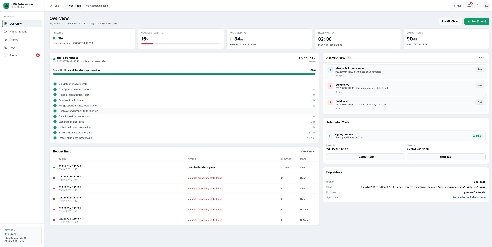
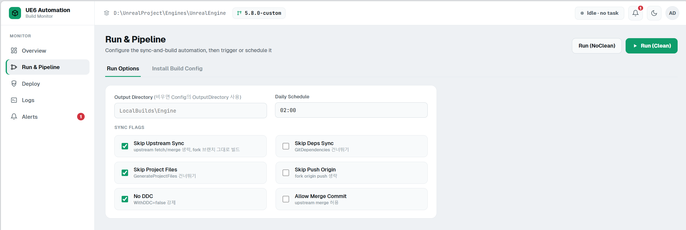
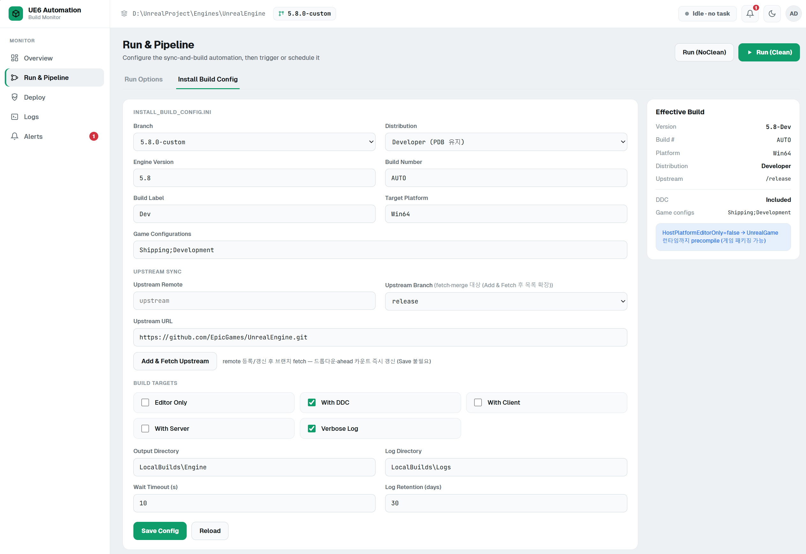
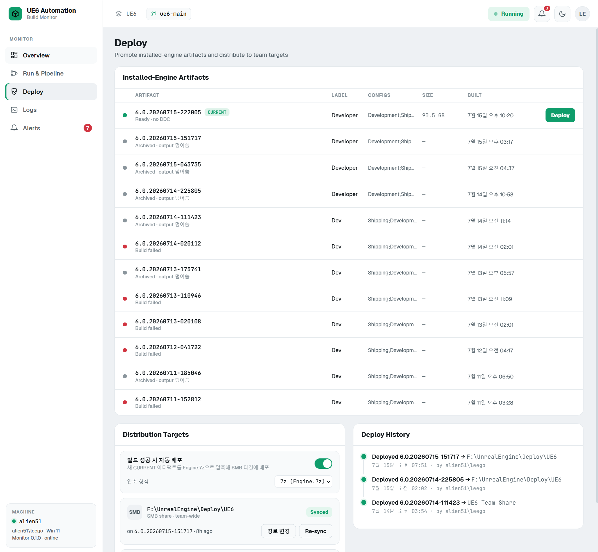
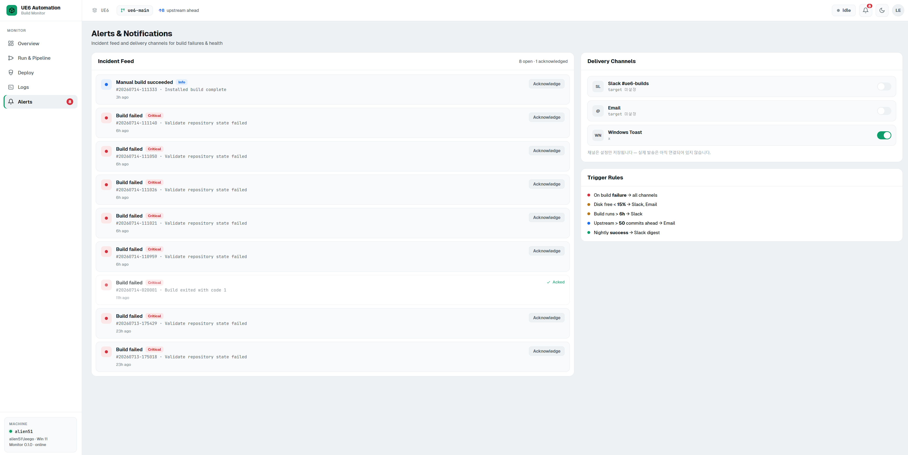

# AutomationMonitor

Unreal Engine 소스 저장소의 **nightly upstream sync**와 **installed-engine build**를 모니터링·실행·배포하는 웹 대시보드입니다.  
`Automation/SyncAndBuildInstalled.ps1` 파이프라인을 감시하고, Windows 작업 스케줄러 등록, 로그 열람, 디스크·upstream 상태 알림, SMB·Google Drive 배포, 릴리스 노트 생성, AI 진단과 직접 해결을 한 화면에서 처리합니다.

이 도구는 자신만의 디렉터리에서 독립적으로 실행되며, 빌드·배포 대상이 되는 언리얼 엔진 클론과는 별도로 존재합니다. 대시보드 상단의 저장소 선택기에서 로컬에 클론된 UE 저장소를 등록·전환하며, 각 저장소는 자신만의 빌드 설정·배포 타깃·알림 설정을 독립적으로 가집니다. 자세한 내용은 [저장소 선택](#저장소-선택)을 참고하세요.

## 주요 기능

| 화면 | 설명 |
|------|------|
| Overview | 파이프라인 상태, 7일 성공률, 디스크·출력 용량, 스케줄 작업, Git/upstream 요약 |
| Run & Pipeline | Run 옵션, 설치 빌드 설정 편집, 즉시 실행·스케줄 등록 |
| Deploy | installed-engine 아티팩트 목록, SMB·Google Drive 동기화 폴더 배포, 자동 배포, 릴리스 노트, 배포 이력 |
| Logs | 빌드·모니터 로그 tail, 필터, 다운로드 |
| AI Diagnostics | 파이프라인 실패 AI 진단 (Codex CLI·OpenAI 호환 API), 자동/수동 실행, 진행 상태·결과, 직접 해결·실행 로그 |
| Alerts | 인시던트 피드, 알림 채널 설정, 트리거 규칙 |

## 스크린샷

### Overview

대시보드에서 파이프라인 idle/running 상태, 최근 실행, 디스크 여유, 스케줄 작업, 활성 알림을 한눈에 확인합니다. 실패한 빌드에 AI 진단 결과가 있으면 최근 실행 테이블의 진단 상태와 요약 카드(원인·영향 파일·권장 해결)도 함께 표시합니다.



### Run & Pipeline — Run Options

Clean/NoClean 실행, 일일 스케줄 시각, upstream/deps/project files/DDC 등 sync 플래그를 설정합니다. 변경 사항은 `workspace.json`에 자동 저장됩니다.



### Run & Pipeline — Install Build Config

브랜치·버전·타깃 플랫폼, upstream remote, 빌드 타깃(Editor/DDC/Client/Server), 출력·로그 경로를 UI에서 편집하고 선택한 저장소의 `LocalBuilds/AutomationMonitor/workspace.json`(`build` 섹션)에 반영합니다. **Verbose Log** 토글(`Logging.Verbose`, 기본 on)은 RunUAT/BuildGraph에 `-Verbose`를 전달하고 BuildGraph 인자를 콘솔에 출력해 디버깅을 돕습니다.

### Deploy

최신 `build_summary_*.txt`가 성공이고 출력 폴더가 존재하면 CURRENT 아티팩트로 표시합니다. SMB에는 `Engine.7z`(또는 `Engine.zip`), Google Drive 동기화 폴더에는 날짜·시간이 붙은 압축 파일과 릴리스 노트를 저장합니다. **빌드 성공 시 자동 배포**를 켜면 선택한 타깃에 새 빌드를 한 번씩 배포합니다. 모니터에서 실행한 빌드와 스케줄 작업 빌드 모두 해당하며 모니터 서버가 실행 중이어야 합니다.





### Alerts & Notifications

빌드 실패, 디스크 부족, 장시간 빌드, upstream 지연 등 인시던트를 표시합니다. Slack·Email·Windows Toast 채널과 임계값을 설정할 수 있습니다. (채널 전송은 설정 저장만 지원, 실제 발송은 미연결)



## Google Drive 배포 및 릴리스 노트

### 동기화 폴더 설정

1. 모니터 서버를 실행하는 Windows 계정에서 Google Drive 데스크톱 앱을 실행하고 로그인합니다.
2. 배포할 동기화 폴더를 만듭니다. 예: `G:\내 드라이브\PublicShare\UnrealEngine6`.
3. **Deploy → Distribution Targets → Google Drive → 경로 지정**에서 폴더의 절대 경로를 입력하거나 찾아보기로 선택합니다.
4. 자동 배포 타깃을 **Google Drive**로 선택하고 **빌드 성공 시 자동 배포**를 켭니다. 압축 형식은 `7z` 또는 `zip`을 선택할 수 있습니다.

자동 배포는 1분 간격으로 확인하며, 켠 시점에 이미 존재하는 빌드는 다시 배포하지 않습니다. 기존 빌드는 Deploy 버튼으로 수동 배포할 수 있습니다. Google Drive 타깃은 해당 빌드의 릴리스 노트가 생성되어 있어야 배포할 수 있습니다.

### 생성 파일

| 파일 | 내용 |
|------|------|
| `Engine-yyyyMMdd-HHmmss.7z` 또는 `.zip` | 설치 빌드 압축 파일 |
| `releasseNote_yyyyMMdd-HHmmss.md` | Z.ai가 머지 내용을 기능별로 정리한 Markdown 릴리스 노트 |

릴리스 노트는 업스트림 머지 직전 HEAD와 빌드 HEAD를 비교하여 성공한 빌드의 로그 폴더(`Paths.LogDirectory`, 기본 `LocalBuilds/Logs`)에 UTF-8 Markdown으로 저장합니다. AI Diagnostics에 저장된 Z.ai의 활성화 여부·base URL·모델·API 키를 사용하므로 별도 인증 설정이 필요하지 않습니다. 빌드 스크립트가 Node 생성기를 직접 실행하므로 예약 빌드에서도 동작하며 모니터 서버 실행 여부와 무관합니다.

Z.ai는 커밋 제목·본문, 순 변경 파일 통계와 코드 diff 표본을 근거로 **주요 변경·기능 및 개선·버그 수정·호환성 및 확인 사항**을 정리합니다. 관련 커밋 해시를 근거로 붙이며, 근거 없는 항목과 검증되지 않은 성능·호환성 주장은 작성하지 않도록 지시합니다. 입력은 최대 500개 커밋/100,000자, 통계 30,000자와 30개 텍스트 파일의 diff 60,000자 표본으로 제한하며 분석 한계를 명시하도록 합니다. 해당 변경 데이터는 설정된 Z.ai 서비스에 전송됩니다. API 키는 노트나 명령 인자에 넣지 않습니다.

API 응답 대기는 최대 3분입니다. Z.ai가 비활성화·미설정 상태이거나 호출에 실패하면 AI 요약 실패 사실을 명시한 Git 근거 Markdown을 남겨 성공한 빌드의 배포를 계속할 수 있게 합니다. 새 커밋·파일 변경이 없으면 AI 호출 없이 기록합니다. 파일은 `.partial` 작성 후 `.md`로 교체하므로 배포가 생성 중인 노트를 복사하지 않습니다. 기존 빌드의 `.txt` 노트도 배포 호환성을 유지하며 `.md`가 있으면 우선합니다. `releasseNote` 철자는 기존 요청 형식을 유지합니다.

압축은 대상 UE 저장소의 `LocalBuilds/AutomationMonitor` 임시 폴더에서 수행한 후 동기화 폴더에 복사합니다. 두 위치에 압축 파일 크기만큼 여유 공간이 필요합니다. 완료된 파일을 동기화하는 실제 업로드는 Google Drive 데스크톱 앱이 담당하며, 화면의 **Saved**는 폴더 저장 완료를 뜻합니다. 클라우드 업로드 완료는 Drive 앱에서 확인하세요.

압축·복사 실패는 배포 이력에 기록되고 수동 재배포할 수 있습니다. 압축 파일과 노트 중 하나만 저장된 뒤 실패하면 먼저 저장된 파일은 남을 수 있습니다. 성공 여부와 자세한 오류는 Deploy History 및 `deploy-*.log`에서 확인합니다.

## AI 진단

파이프라인이 실패하면 래퍼 로그와 UBT 빌드 출력 로그 tail을 AI 프로바이더에 보내 **요약·근본 원인·영향 파일·권장 해결책·신뢰도**를 JSON으로 받아 보여줍니다. Fetch처럼 엔진 빌드 전 단계에서 실패한 경우에는 래퍼 로그로 진단합니다. AI Diagnostics와 Overview에서 진행 상태와 저장된 진단 결과를 확인할 수 있습니다.

- **프로바이더**
  - **Codex CLI** (기본): 로컬에 설치된 `codex` CLI의 ChatGPT OAuth 세션(`codex login`)을 재사용하므로 API 키가 필요 없습니다. `--sandbox read-only`로 비대화형 실행하며, CLI 경로와 모델을 지정할 수 있습니다.
  - **Z.AI International**: OpenAI 호환 API. API 키와 base URL이 필요하며 연결 테스트 후 모델 목록을 불러올 수 있습니다.
- **Primary/Secondary**: primary가 실패하면 secondary, 그 다음 활성화된 프로바이더 순으로 폴백합니다.
- **자동 진단**: `autoDiagnose`를 켜면 빌드 실패를 감지할 때마다 자동으로 진단합니다 (기본 off). 수동 실행은 어느 때나 가능하며 기본 대상은 최근 실패 run입니다.
- **토큰 예산**: `maxTokens`(기본 120,000)에 맞춰 긴 로그는 앞부분(맥락)과 뒷부분(에러)을 남기고 중간을 잘라 보냅니다.
- **API 키 보호**: 저장된 키는 조회 시 `[REDACTED]`로 마스킹되며, 재저장해도 기존 키가 유지됩니다. 진단 결과는 `workspace.json`의 `ai.diagnostics`에 run 로그 이름별로 저장됩니다.

### 직접 해결

1. **AI Diagnostics → 최근 실패 실행 · AI 진단 결과**에서 진단 완료를 확인합니다. 자동 진단을 사용하지 않으면 **최근 실패 로그 수동 진단**을 먼저 실행합니다.
2. 해당 결과의 **직접 해결**을 누릅니다. Overview의 AI 진단 카드에서도 같은 버튼을 사용할 수 있습니다.
3. **실행 로그**에서 진행 상황을 확인하고, 완료 후 수정 파일·검증 결과·다음 조치를 검토합니다.
4. 해결 완료 후 빌드를 다시 실행하여 전체 파이프라인 성공 여부를 확인합니다.

진단이 성공한 실패 실행에만 직접 해결 버튼을 제공합니다. 진단 프로바이더가 Z.AI여도 실제 수정은 로컬 Codex CLI가 수행하므로 Codex 로그인과 `codex.exe`가 필요합니다. 실행 파일을 자동으로 찾지 못하면 AI 설정의 CLI 경로에 지정하세요. 서버 PC에서 `http://127.0.0.1:4174` 또는 개발 UI `http://127.0.0.1:5173`로 접속해야 실행할 수 있습니다.

| 상태 | 의미 |
|------|------|
| AI가 직접 해결 중 | 진단·로그를 확인하고 로컬 파일·설정 수정 및 검증을 수행 중 |
| 해결 완료 | AI가 수정 내용과 원래 실패 원인에 대한 검증 결과를 보고함 |
| 사용자 조치 필요 | 인증·접근 권한 등 직접 처리해야 할 조치가 남음 |
| 해결 실패 | 실행 오류 또는 해결·검증 실패. 실행 로그 확인 필요 |
| 작업 추적 중단 | 서버 재시작으로 추적이 중단됨. 로그와 변경 파일 확인 필요 |

수정 실행은 `workspace-write`로 대상 UE 저장소와 자동화 도구 경로에 쓰기 권한을 부여하고 Fetch 검증 등을 위한 네트워크 접근을 허용합니다. 기존 변경을 보존하며 전체 엔진 재빌드·커밋·푸시·배포는 수행하지 않도록 지시합니다. 작업 제한은 20분입니다. 빌드·배포 중에는 시작할 수 없고, 해결 작업 중에는 모니터의 빌드 실행·저장소 전환·배포가 차단됩니다. Windows 작업 스케줄러가 외부에서 시작하는 빌드와 겹치지 않도록 운영해야 합니다.

작업 이력은 `monitor-state.json`의 `aiFixHistory`, 실행 로그는 `LocalBuilds/AutomationMonitor/ai-fix-<작업 ID>.log`에 저장됩니다. 서버 재시작 후 자동 재개하지 않으며 이전 프로세스가 살아 있으면 새 해결 작업을 시작하지 않습니다.

### Google Drive 배포가 `spawn 7z ENOENT`로 실패하는 경우

7-Zip 실행 파일을 찾지 못해 압축 단계에서 실패한 것입니다. 서버 시작 시와 배포 시작 전에 7-Zip 설치 여부를 확인하며, 없으면 winget으로 자동 설치합니다. 기존 설치 경로와 PATH의 `7z`를 먼저 확인합니다. 설치에는 인터넷 연결과 관리자 권한이 필요할 수 있으며, winget 패키지·원본 약관에 자동 동의합니다. 설치 대기는 최대 10분이고 완료 후 실행 파일 동작을 검증합니다.

서버 시작 시 설치가 실패해도 서버는 계속 실행하며, 배포 시 다시 설치를 시도합니다. 배포 시 설치 실패는 오류로 반환하고 압축을 시작하지 않습니다. 수동 설치가 필요하면 관리자 터미널에서 `winget install --id 7zip.7zip --exact`를 실행하세요. 이후 Distribution Targets에서 Google Drive 배포를 다시 실행합니다. 자동 배포는 빌드당 한 번만 시도하므로 실패한 빌드는 수동 재시도가 필요합니다.

배포할 때마다 7-Zip 설치 경로를 다시 확인하므로 서버 실행 중 설치해도 감지합니다. 이 수정 이전 버전의 서버가 실행 중이면 업데이트 후 서버를 한 번 재시작하세요. 동기화 폴더 복사 완료 후 실제 클라우드 업로드 상태는 Google Drive 데스크톱 앱에서 확인합니다.

## 요구 사항

Upstream ahead는 저장소 활성화 시와 이후 **5분마다 자동 Fetch**하여 최신 원격 커밋을 반영합니다. 서버는 1분마다 실행 시점을 확인하며, 설정된 upstream 브랜치만 가져옵니다. Fetch 성공 시 Git 상태 캐시를 지워 화면의 다음 갱신에 반영합니다. 자동 Fetch는 병합·커밋·푸시를 수행하지 않습니다.

빌드·예약 작업·AI 수정 중이거나 upstream 동기화가 비활성화된 저장소에서는 건너뜁니다. Fetch 중에는 새 빌드·AI 수정·저장소 전환을 잠시 차단합니다. 원격 인증은 기존 Git 인증을 사용하며 대화형 로그인 창은 띄우지 않습니다. Fetch는 최대 2분 대기하고, 실패 이유를 `monitor.log`에 기록한 뒤 다음 주기에 재시도합니다. 외부에서 직접 시작하는 Git 작업이나 예약 작업과의 동시 실행까지 잠그지는 않습니다.

- Windows 10/11
- [Node.js](https://nodejs.org/) — 설치된 Vite 버전의 요구 사항 충족 필요 (현재 Vite 8: 20.19+ 또는 22.12+)
- Git, PowerShell 5.1+
- Windows SDK Debugging Tools — 서버 시작 시 x64 도구를 확인하고, 없으면 winget으로 자동 설치합니다. 최초 설치에는 인터넷 연결과 Windows 관리자 권한이 필요할 수 있습니다.
- [7-Zip](https://www.7-zip.org/) — 배포 압축용. 서버 시작·배포 시 설치 경로와 PATH를 확인하고, 없으면 winget으로 자동 설치합니다.
- 모니터링 대상: 로컬에 클론된 Unreal Engine 저장소 (`.git` 포함) — 저장소 선택기에서 등록
- (선택) AI 진단 프로바이더: 로컬 Codex CLI 로그인 세션(`codex login`), 또는 OpenAI 호환 API 키 — 없으면 AI 진단만 비활성
- (선택) Google Drive 배포: 로그인한 Google Drive 데스크톱 앱과 접근 가능한 동기화 폴더
- (선택) AI 직접 해결: 로컬 Codex CLI의 `codex.exe`와 로그인 세션
- 빌드 로그: `<선택한 저장소>/LocalBuilds/AutomationLogs/`
- 모니터 로그·상태·설정: `<선택한 저장소>/LocalBuilds/AutomationMonitor/`

## 빠른 시작

### 원클릭 실행 (권장)

API 서버는 **Windows 관리자 권한으로만 실행**됩니다. `Start-Dev.cmd`·`Start-Prod.cmd` 및 PowerShell 실행 파일은 일반 권한이면 UAC 승인을 요청하여 관리자 권한으로 다시 시작합니다. UAC를 취소하면 실행하지 않습니다. `Start-Server.bat`는 우클릭 → **관리자 권한으로 실행**을 선택하세요. `node server/index.js`·npm 명령으로 직접 실행할 때도 관리자 터미널이 필요하며, 일반 권한이면 서버가 오류 안내 후 종료합니다. 관리자 권한은 작업 스케줄러 등록과 필수 도구 설치에 사용됩니다.

상시 실행 작업을 등록하는 `Register-MonitorServerTask.ps1`도 관리자 PowerShell에서 실행해야 합니다. 등록되는 서버 작업은 `Highest` 권한으로 실행합니다. 이전에 등록한 서버 작업은 스크립트를 다시 실행하여 갱신하세요.

| 모드 | 실행 파일 | 접속 URL |
|------|-----------|----------|
| 개발 | `Start-Dev.cmd` 또는 `start-dev.ps1` | http://127.0.0.1:5173 |
| 운영 | `Start-Prod.cmd` 또는 `start-prod.ps1` | http://127.0.0.1:4174 |
| 운영 (배치) | `Start-Server.bat` | http://127.0.0.1:4174 |
| 종료 | `Stop.cmd` 또는 `stop.ps1` | — |

개발 모드는 API 서버(`4174`)와 Vite HMR UI(`5173`) 두 프로세스를 띄웁니다. 운영 모드는 `vite build` 후 단일 Node 프로세스가 UI와 API를 함께 제공합니다. `Stop.cmd`는 두 포트(`4174`·`5173`)의 프론트엔드·백엔드를 한 번에 종료합니다. `Start-Server.bat`는 PowerShell 래퍼 없이 순수 배치로 같은 운영 동작(의존성 설치·UI 빌드·포트 정리 후 서버 실행)을 수행하며, `--no-build`, `--no-browser`, 포트 번호를 인자로 받습니다.

### Windows SDK Debugging Tools 자동 설치

개발·운영 모드 모두 API 서버 시작 시 `C:\Program Files (x86)\Windows Kits\10\Debuggers\x64`의 `pdbcopy.exe`, `windbg.exe`, `cdb.exe`, `dbghelp.dll`을 확인합니다. 이미 설치되어 있으면 설치를 건너뛰며, 일부 DLL만 있는 경우에도 필요한 도구를 추가 설치합니다.

도구가 없으면 winget의 `Microsoft.WindowsSDK.10.0.26100` 패키지에서 **Debugging Tools for Windows** 구성 요소만 설치합니다. 패키지·원본 약관에 자동 동의하며, 자동 재부팅은 하지 않습니다. 설치하는 동안 서버 접속이 지연될 수 있고 설치 상태는 서버 터미널에 표시됩니다. Windows 관리자 권한 요청이 나타나면 승인하세요. 설치 대기는 최대 15분이며, 설치 완료 후 실행 파일을 다시 확인합니다.

winget이 없거나 네트워크·권한 문제로 설치가 실패하면 서버는 계속 실행합니다. 서버 터미널에 오류와 수동 설치 명령을 남기며 다음 서버 실행 때 다시 시도합니다. 도구가 없는 상태에서는 Installed Build가 실패할 수 있습니다. 수동 설치가 필요하면 관리자 터미널에서 다음 명령을 실행하세요.

```powershell
winget install --id Microsoft.WindowsSDK.10.0.26100 --exact --force --override "/features OptionId.WindowsDesktopDebuggers /quiet /norestart" --accept-package-agreements --accept-source-agreements --disable-interactivity
```

winget을 사용할 수 없으면 [Microsoft의 Debugging Tools 설치 안내](https://learn.microsoft.com/en-us/windows-hardware/drivers/debugger/debugger-download-tools)에 따라 Windows SDK 설치 프로그램에서 **Debugging Tools for Windows**를 선택하세요. 이 자동 설치는 SDK 디버깅 도구를 준비하며, Smart App Control 차단 문제는 아래의 별도 해결 절차를 따라야 합니다.

### 수동 실행

```powershell
cd AutomationMonitor
npm install

# 개발: 터미널 1
npm run dev

# 개발: 터미널 2
npm run ui

# 운영
npm run prod
```

### Windows 작업 스케줄러로 상시 구동

이 도구의 저장소 루트에서 (대상 UE 저장소가 아님):

```powershell
.\Automation\Register-MonitorServerTask.ps1
```

기본 포트는 `4174`입니다. 변경 시 환경 변수를 사용합니다.

```powershell
$env:UE6_MONITOR_PORT = "8080"
$env:UE6_MONITOR_HOST = "0.0.0.0"   # 기본값
```

## 저장소 선택

AutomationMonitor는 `Automation/`(파이프라인 스크립트)와 함께 자신만의 디렉터리에 위치하며, 빌드 대상 UE 저장소와는 분리되어 있습니다. 대시보드 상단의 저장소 표시를 클릭하면 저장소 관리 모달이 열립니다.

- **등록**: 로컬 경로(폴더 찾아보기 지원)를 입력해 UE 클론을 등록합니다. `.git`이 있어야 합니다. 처음 등록한 저장소가 자동으로 활성 저장소가 됩니다.
- **전환**: 목록에서 다른 저장소를 선택하면 즉시 활성 저장소가 바뀝니다. 빌드가 실행 중일 때는 전환·삭제할 수 없습니다.
- **저장 위치**: 등록된 저장소 목록·활성 선택은 `AutomationMonitor/repos.json`에 저장됩니다 (호스트별 경로라 git에 커밋되지 않음). 각 저장소의 빌드 설정·Run 옵션·배포 타깃·알림 임계값은 해당 저장소의 `LocalBuilds/AutomationMonitor/workspace.json`에 독립적으로 저장됩니다.
- 저장소를 하나도 등록하지 않았다면 대시보드는 빈 상태 화면만 보여줍니다.

## 아키텍처

```
Automation/          # 파이프라인 스크립트 (SyncAndBuildInstalled.ps1 등) — 도구 소유, 대상 저장소와 무관
AutomationMonitor/
├── server/          # Node HTTP API (상태 수집, 실행, 배포, 저장소 레지스트리, AI 진단)
├── src/             # React UI (Vite)
├── repos.json       # 등록된 저장소 목록·활성 선택 (gitignored)
├── dist/            # 운영 빌드 산출물 (vite build)
└── start-*.ps1      # 원클릭 런처
```

- **프론트엔드**: React + Vite. 5초마다 `/api/status` 폴링.
- **백엔드**: 순수 Node `http` 서버. PowerShell·`git`·`7z` 호출은 현재 활성 저장소를 대상으로 실행. 자동 배포 워처는 1분마다 새 CURRENT 아티팩트를 확인.
- **파이프라인 파싱**: `SyncAndBuildInstalled.ps1` 래퍼 로그의 `START`/`DONE`/`FAILED` 단계와 UBT 빌드 로그를 합쳐 진행률 계산.
- **설정**: UI 편집 값은 활성 저장소의 `LocalBuilds/AutomationMonitor/workspace.json`에 저장합니다. `install_build_config.ini`는 초기 설정 이관 및 이전 스크립트 호환용입니다. ACK·배포·AI 해결 이력은 같은 폴더의 `monitor-state.json`에 저장합니다.

### 파이프라인 단계

다음 13단계는 대시보드 진행률에 표시되는 단계입니다. 성공 후 스크립트에서 `Write release notes`를 추가 실행하며, 이 단계는 현재 진행률 목록에는 별도로 표시하지 않습니다.

1. Check application control policy (Smart App Control 사전 검사)
2. Validate repository state (sync 전 `Templates/`의 tracked 변경은 자동 discard — 빌드/에디터가 다시 쓰는 `DefaultEngine.ini`가 매번 sync를 막던 문제 해결)
3. Configure upstream remote
4. Fetch origin and upstream
5. Checkout build branch
6. Merge upstream into local branch
7. Check for merge conflict markers (컨플릭트 마커를 통째로 커밋한 "해결"이 push·빌드까지 진행되는 것을 사전 차단 — 수 초 만에 실패시키며 `-SkipUpstreamSync` 시에도 항상 실행)
8. Push synced branch to fork origin
9. Sync Unreal dependencies
10. Generate project files
11. Install build pre-processing
12. Build Win64 installed engine
13. Install build post-processing

## 설정 파일

### workspace.json

활성 저장소의 `LocalBuilds/AutomationMonitor/workspace.json`에 저장됩니다 (저장소마다 별도 파일).

| 섹션 | 용도 |
|------|------|
| `build` | 설치 빌드 설정. 초기 생성 시 `install_build_config.ini`에서 이관 |
| `runOptions` | Run 탭 플래그·스케줄 시각·출력 디렉터리 |
| `deploy.targets` | SMB(`smb`)·Google Drive 동기화 폴더(`gdrive`) 배포 타깃. P4는 스텁 |
| `deploy.auto` | 빌드 성공 시 자동 배포 on/off와 대상 타깃 (`{ enabled, targetId }`) |
| `deploy.format` | 배포 압축 형식 — `7z`(기본) 또는 `zip` |
| `alerts.channels` | Slack, Email, Windows Toast on/off |
| `alerts.thresholds` | 디스크 %, upstream 커밋 수, 빌드 시간(h) |
| `ai` | AI 진단 — 프로바이더 설정(Codex CLI·OpenAI 호환), primary/secondary, `autoDiagnose`, `maxTokens`, run별 진단 결과(`diagnostics`) |

### 로컬 설정과 인증정보

실제 API 키는 대상 UE 저장소의 `LocalBuilds/AutomationMonitor/workspace.json`에 로컬로 저장됩니다. 브라우저 조회 시 마스킹되지만 파일 자체는 암호화되지 않으므로 접근 권한을 관리해야 합니다. Codex·Google Drive 로그인 정보는 각 앱이 관리하며 저장소에 복사할 필요가 없습니다.

이 도구 저장소는 `.env`, 인증 파일(`.pem`·`.p12`·`.pfx`, `credentials.json`, `client_secret*.json`, `service-account*.json`), `rclone.conf`, `LocalBuilds/`, `repos.json`, 실행 로그 등을 Git에서 제외합니다. 대상 UE 저장소에도 `LocalBuilds/` 제외 규칙이 적용되는지 확인하세요. 이 도구의 `.gitignore`는 별도 UE 저장소까지 적용되지 않습니다.

### 환경 변수

| 변수 | 기본값 | 설명 |
|------|--------|------|
| `UE6_MONITOR_PORT` | `4174` | API·운영 UI 포트 |
| `UE6_MONITOR_HOST` | `0.0.0.0` | 바인드 주소 |

## API 개요

| Method | Path | 설명 |
|--------|------|------|
| GET | `/api/status` | 전체 상태 (Git, 파이프라인, 디스크, 알림, 로그 목록) |
| POST | `/api/run-now` | 즉시 빌드 실행 |
| POST | `/api/stop` | 실행 중인 빌드 종료 (모니터 실행·스케줄 작업 실행 모두) |
| POST | `/api/register-task` | 야간 스케줄 작업 등록 |
| POST | `/api/start-task` | 등록된 스케줄 작업 즉시 시작 |
| GET/POST | `/api/install-config` | `workspace.json`의 설치 빌드 설정 읽기/쓰기 |
| POST | `/api/upstream/register` | upstream remote 추가 및 fetch |
| GET | `/api/logs/:name` | 로그 tail |
| GET/POST | `/api/ai/config` | AI 프로바이더·자동 진단 설정 (조회 시 API 키는 `[REDACTED]` 마스킹) |
| POST | `/api/ai/test` | 프로바이더 연결 테스트 (`{ providerId, config? }`) |
| POST | `/api/ai/models` | 프로바이더 모델 목록 조회 (`{ providerId, config? }`) |
| POST | `/api/ai/diagnose` | 빌드 진단 실행 (`{ logName }`, 생략 시 최근 실패 run) |
| GET | `/api/ai/fix` | 직접 해결 작업 상태·이력 조회 (서버 PC의 로컬 요청만 허용) |
| POST | `/api/ai/fix` | 직접 해결 시작 (`{ logName }`, 완료된 진단 필요) |
| GET | `/api/ai/fix/log?id=<작업 ID>` | 직접 해결 실행 로그 조회 |
| GET | `/api/deploy` | 아티팩트·타깃·자동 배포 설정·압축 형식·이력 |
| POST | `/api/deploy/start` | SMB 또는 Google Drive 동기화 폴더 배포 시작 (`{ targetId }`) |
| POST | `/api/deploy/targets` | 타깃 이름·경로 저장 (타깃 객체 배열) |
| POST | `/api/deploy/format` | 압축 형식 저장 (`{ format: "7z" \| "zip" }`) |
| POST | `/api/deploy/auto` | 자동 배포 on/off (`{ enabled, targetId }`) |
| GET | `/api/repos` | 등록된 저장소 목록·활성 선택 |
| POST | `/api/repos` | 저장소 등록 (`{ name, path }`) |
| DELETE | `/api/repos/:id` | 저장소 삭제 |
| POST | `/api/repos/active` | 활성 저장소 전환 (`{ id }`) |

## UI 동작 메모

- **Run (Clean)**: `-NoClean` 없이 전체 파이프라인 실행.
- **Run (NoClean)**: 증분 빌드용 `-NoClean` 전달.
- **Stop**: 모니터가 시작한 실행은 `taskkill /PID <pid> /T /F`로 PowerShell 하위 UAT·UBT까지 트리 종료하고, 스케줄 작업이 시작한 실행은 `Stop-ScheduledTask` 후 CIM으로 해당 PowerShell 트리를 찾아 종료합니다. Stop 시점 이전에 시작된 run은 즉시 "Cancelled by user (Stop Run)"로 표시됩니다.
- **Add & Fetch Upstream**: Epic 원격 등록 후 지정 브랜치만 fetch (HTTP/1.1 강제).
- **Deploy**: SMB는 `.partial` 파일 압축 완료 후 `Engine.<format>`으로 교체합니다. Google Drive는 로컬 압축 후 동기화 폴더에 날짜·시간별 압축 파일과 릴리스 노트를 복사하고, 앱이 클라우드 동기화를 수행합니다.
- **자동 배포**: 켠 시점의 CURRENT 아티팩트를 기준선으로 잡아 과거 빌드를 다시 배포하지 않습니다. 빌드당 한 번만 시도하며, 실패하면 재시도 없이 모니터 로그에 남깁니다.
- **AI 진단**: 자동·수동 진단 결과와 진행 상태는 AI Diagnostics 및 Overview에 표시합니다. 모니터에서 실행한 파이프라인은 프로세스 종료 직후 진단 확인을 시작합니다.
- **직접 해결**: 완료된 진단의 버튼으로 수정 작업을 시작합니다. 작업 결과와 실행 로그를 확인한 뒤 빌드를 다시 실행합니다.
- **테마**: 사이드바 하단·상단의 라이트/다크 토글. `localStorage`에 저장.

## 트러블슈팅

### App Control 오류로 빌드가 시작되지 않을 때 (`0x800711C7`)

**증상**: `Check application control policy failed`와 `Smart App Control is ON`이 표시되거나, AutomationTool의 `Initializing script modules` 단계에서 `SteamDeck.Automation.dll` 등 로컬 빌드 DLL을 로드하지 못하고 `0x800711C7` 오류가 발생합니다. 현재 스크립트의 사전 검사는 Smart App Control 상태가 `On`이면 빌드를 시작하기 전에 중단합니다.

**원인**: Windows Smart App Control 또는 조직의 App Control 정책이 로컬에서 생성한 신뢰되지 않은 DLL의 실행을 차단할 수 있습니다. 원인에 따라 설정을 바꾸거나 해당 정책에 맞게 파일을 서명·허용해야 합니다.

**해결 순서**:

1. PowerShell에서 현재 Smart App Control 상태를 확인합니다.

   ```powershell
   Get-MpComputerStatus | Select-Object SmartAppControlState
   ```

2. `On`이고 이 PC에서 보호 기능을 끄는 것이 허용된다면 **Windows 보안 → 앱 및 브라우저 컨트롤 → Smart App Control 설정 → 끄기**를 선택합니다. 이 변경은 Smart App Control의 앱 실행 보호를 비활성화합니다.
3. 위 명령을 다시 실행해 `Off`로 반영됐는지 확인한 후 빌드를 다시 실행합니다. 설정 화면을 닫았거나 끄기를 선택했다는 사실만으로 적용됐다고 판단하지 마세요. 현재 상태 판단에는 `Get-MpComputerStatus`를 사용하며, 레지스트리의 CI 정책 값은 참고 정보입니다.
4. `Off`인데도 실제 DLL 로딩에서 같은 차단 오류가 발생하면 작업을 저장하고 재부팅한 뒤 상태와 빌드를 다시 확인합니다. 여전히 차단되면 **이벤트 뷰어 → 응용 프로그램 및 서비스 로그 → Microsoft → Windows → CodeIntegrity → Operational**에서 차단 파일과 정책을 확인하고, 조직의 App Control for Business(WDAC)·AppLocker 정책 담당자에게 허용 정책 또는 서명 적용을 요청하세요. [Microsoft App Control 문제 해결 안내](https://learn.microsoft.com/en-us/windows/security/application-security/application-control/app-control-for-business/operations/appcontrol-debugging-and-troubleshooting)

**재부팅 판단**: 상태가 `On`인 채로 재부팅만 해서는 사전 검사 실패를 해결할 수 없습니다. 먼저 설정 변경이 `Off`로 반영되는지 확인하세요. `Off` 반영 후 바로 재시도할 수 있으며, 계속 차단되거나 Windows가 재시작을 요구할 때 재부팅을 진행합니다. 재부팅으로 모든 App Control 정책이 해제되는 것은 아닙니다.

Smart App Control에는 개별 앱만 허용하는 예외 기능이 없습니다. 조직이 관리하는 WDAC·AppLocker의 허용 정책과는 구분해야 합니다. 최근 Windows 업데이트에서는 Smart App Control을 Windows 재설치 없이 다시 켤 수 있으며, 해당 PC에서 제공되는 설정을 확인하세요. [Microsoft Smart App Control FAQ](https://support.microsoft.com/en-us/windows/security/threat-malware-protection/smart-app-control-frequently-asked-questions)

### Fetch에서 실패했는데 AI 진단 결과가 보이지 않을 때

AI Diagnostics에서 **빌드 실패 시 자동으로 AI 진단 실행**을 켜고 **설정 저장**을 누르세요. **최근 실패 실행 · AI 진단 결과**에서 진단 중·완료·실패 상태를 확인합니다. Fetch는 빌드 출력 로그가 없어도 래퍼 로그로 진단할 수 있으며 Git 원문 오류가 래퍼 로그에 기록됩니다. 진단 실패 시 프로바이더 연결 테스트 또는 수동 진단을 사용하세요.

### Google Drive 배포가 실패하거나 업로드되지 않을 때

Drive 앱의 로그인·실행 상태, 지정 폴더 존재 여부, 서버 계정에서의 경로 접근 및 디스크 여유 공간을 확인하세요. 릴리스 노트가 없다는 오류라면 해당 빌드의 `releasseNote_*.md`(기존 빌드는 `.txt`)가 생성됐는지 확인합니다. Saved인데 웹 Drive에 파일이 보이지 않으면 앱의 동기화 대기·오류 상태를 확인해야 합니다.

### 직접 해결 버튼이 동작하지 않을 때

서버 PC에서 로컬 URL로 접속하고, Codex 로그인과 `codex.exe` 경로를 확인하세요. 빌드·배포 또는 다른 해결 작업이 실행 중이면 끝난 뒤 다시 시도합니다. **사용자 조치 필요**이면 결과의 다음 조치를 수행하세요. 해결 완료는 해당 실패 원인의 검증 결과이므로 전체 엔진 빌드 성공은 재실행으로 확인해야 합니다.

### 빌드는 SUCCESS인데 출력물이 비정상적으로 작을 때 (Templates/FeaturePacks 누락)

빌드 요약이 SUCCESS인데 출력 크기가 평소(수십 GB)보다 훨씬 작고 `Engine/Content`·`Templates`·`FeaturePacks`가 없다면, BuildGraph의 `Make Installed Build` 메인 복사 단계가 통째로 스킵된 것입니다. `InstalledBuild-*-output.log`에서 다음 패턴을 찾으세요:

```
Error while trying to create file pattern match for '...': Source file '...' does not exist
```

`Engine/Build/InstalledEngineFilters.xml`에 정확 경로로 명시된 파일이 디스크에 없으면 해당 복사 전체가 중단되는데, **종료 코드는 0이라 요약에는 SUCCESS로 기록됩니다.** 주로 upstream이 gitdeps에서 바이너리 의존성을 제거(→ 다음 Setup.bat이 로컬 파일을 prune)하면서 필터 XML의 참조 정리를 빠뜨릴 때 발생합니다.

실제 사례 (2026-07-16): upstream `f2e0d9a12c91`(UE-384283)이 cl-filter를 gitdeps에서 제거했지만 필터 XML의 `Engine/Build/Windows/cl-filter/cl-filter.exe` 참조를 남겨둠 → 야간 sync 후 Setup.bat이 exe를 삭제 → 이후 빌드가 4GB짜리 깡통으로 나옴. 필터 XML에서 해당 줄을 제거해 해결 (UE6 저장소 `fdc4af80c6a4`).

**대처**: 로그의 에러가 가리키는 파일을 필터 XML에서 제거하거나(도구가 더 이상 안 쓰이는 경우), 파일을 복구하세요. 없어진 exe는 런처 설치 엔진(`C:\Program Files\Epic Games\UE_*`)의 같은 경로에서 복사해올 수 있습니다.

## 관련 스크립트

도구 루트 `Automation/` (대상 UE 저장소가 아니라 이 도구에 속함):

- `SyncAndBuildInstalled.ps1` — 실제 sync·build 파이프라인. `-RepoRoot`(대상 UE 클론 경로) 필수 — AutomationMonitor가 활성 저장소를 자동으로 전달합니다.
- `Register-NightlyInstalledBuildTask.ps1` — 야간 빌드 작업 스케줄러 등록. 마찬가지로 `-RepoRoot` 필수.
- `Register-MonitorServerTask.ps1` — 모니터 서버(이 도구 자체) 상시 구동 등록

## 개발 검증

`AutomationMonitor` 디렉터리에서 실행합니다.

```powershell
node --test server/*.test.js server/ai/fix.test.js
npm.cmd run build
```

테스트는 실제 Google Drive 업로드·AI 수정·SDK 및 7-Zip 설치를 실행하지 않고 작업 흐름·실패 처리·중복 실행 방지와 도구 설치 분기를 검증합니다.

## 라이선스

저장소 루트 `LICENSE`를 따릅니다.
